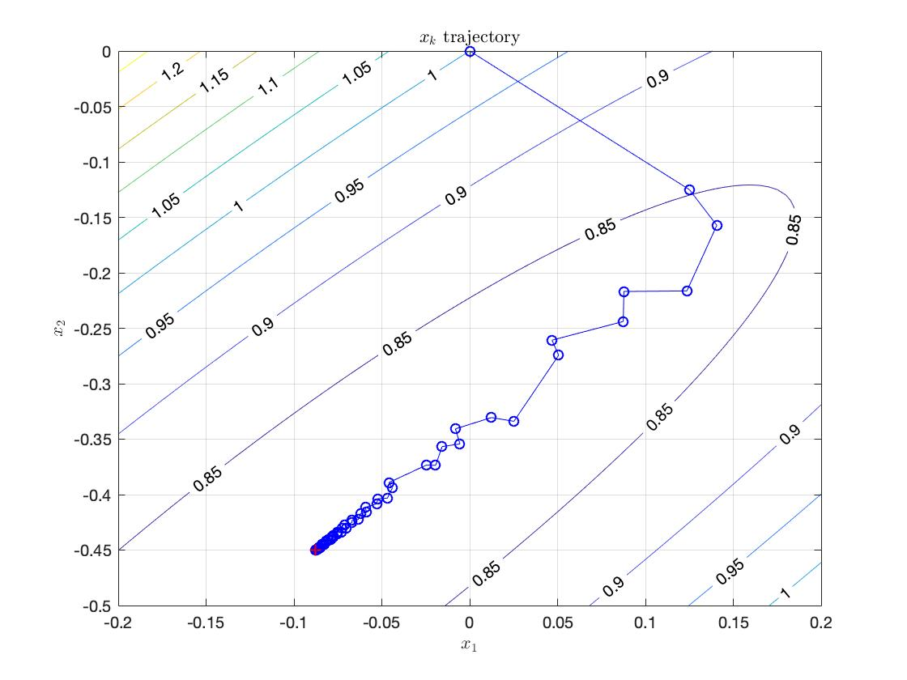
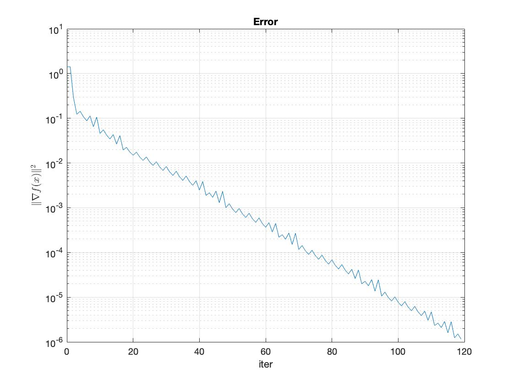
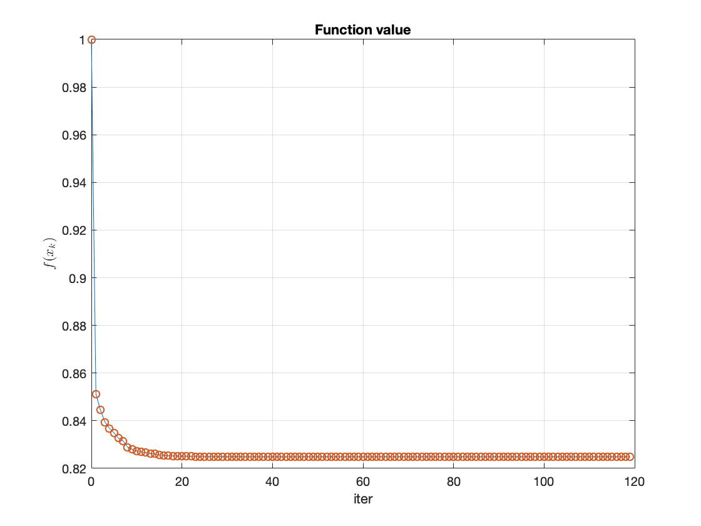

# gd_matlab

Gradient descent with Armijo line search

1. Objective function:   
2. Gradient:   
3. Initial point:   
4. Stoping criterion:   
5. Armijo line search parameters:   

Results:  
1. Solution trajectory:   
2. Error curve:   
3. Objectuve function value:   
